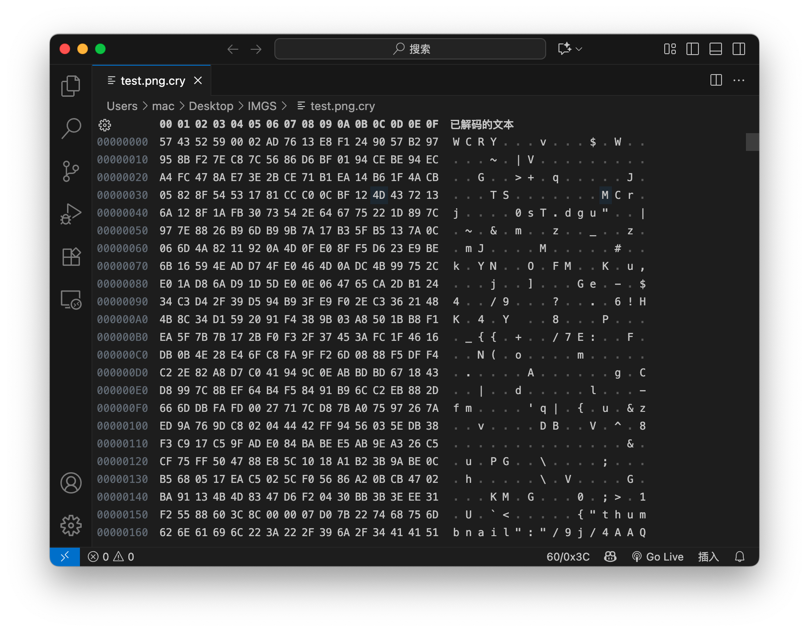

# little-secret
基于 Argon2 和 ChaCha20 的资料加密工具。

## 技术栈
Rust、tauri、argon2、chacha20、React (Preact)、tailwindcss、Vite

## 起因

每个人都有自己的小秘密，所以每个人都会有加密文件的需求，以前我会用压缩包的形式来加密文件，但这种方式使用起来非常痛苦：

- 1.压缩包只能作为一个整体传输和复制，没传完就没法使用，对于网络传输很不友好。
- 2.如果我想寻找某个文件，必须解压出来一个个寻找。
- 3.体积大且集中。

 

#### 我的需求是：

- 1.以文件为单位加密，更灵活。
- 2.可以通过密码直接打开文件，而不是先解密，用完再加密。
- 3.我需要一张模糊的缩略图，来大致预览文件的内容。
- 4.需要适合网络传输，例如网盘。
- 5.安全，抗暴力破解、抗字典和彩虹表攻击。

 

#### 加密方案
使用 __Argon2id__ 派生秘钥 + __ChaCha20__ 加密 + __HMAC SHA-256__ 校验结果。

#### 思路
由于需求比较独特，最终我打算自己设计一种文件格式。

为了支持多密码，同时高效的修改密码，我们可以采用信封模式： 使用一个秘钥 (CEK) 加密文件，再派生多个 KEK 秘钥 加密 CEK 秘钥。 解密时只需要使用密码求出一个 KEK，解出 CEK，再使用 CEK 解密文件。 修改密码也只需解出 CEK 再使用新密码派生 KEK，无需重新加密整个文件。 然后存储一个缩略图作为元数据即可。

##### 让我们来设计文件格式：

| 长度(字节)    | 取值       | 名称                     | 说明                            |
|-----------|----------|------------------------|-------------------------------|
| 4         | WCRY     | Magic                  | 固定的文件标识                       |
| 2   (大端序) | Number   | Password Count         | 密码数量                          |
| 72 * N    | 密码块      | Entries                | 多个密码块，数量 N 取决于 Passwrod Count |
| 128       | (加密)随机字节 | Encrypted Verify Block | 验证块                           |
| 32        | 哈希值      | Verify Block HMAC      | 验证块的哈希值，用于判断解密是否成功            |
| 32        | 原文件的哈希值  | File HMAC              | 用于验证文件完整性                     |
| 4   (大端序) | Number   | Metadata Length        | 元数据的长度                        |
| N         | Byte[]   | Metadata               | 元数据                           |
| N         | Byte[]   | Encrypted Content      | 原始文件加密后的密文                    |

 

##### 每个密码块又分为：

| 长度(字节) | 取值         | 名称                     | 说明            |
|--------|------------|------------------------|---------------|
| 16     | 随机字节       | Salt                  | 用于密码派生的随机盐    |
| 12     | 随机字节       | KEK Nonce        | KEK 对应的 Nonce |
| 32     | (加密) CEK秘钥 | Encrypted CEK                | 用于加密文件的CEK    |
| 12     | (加密) 随机字节  | Encrypted CEK Nonce | CEK 对应的 Nonce |

 

### 性能

在配置为 12900K 的 Windows PC 上测试，release 编译的情况下，每分钟可加密 1200 张图片(每张约10MB)。数据仅供参考，实际性能取决于处理器规模和磁盘IO速度。
